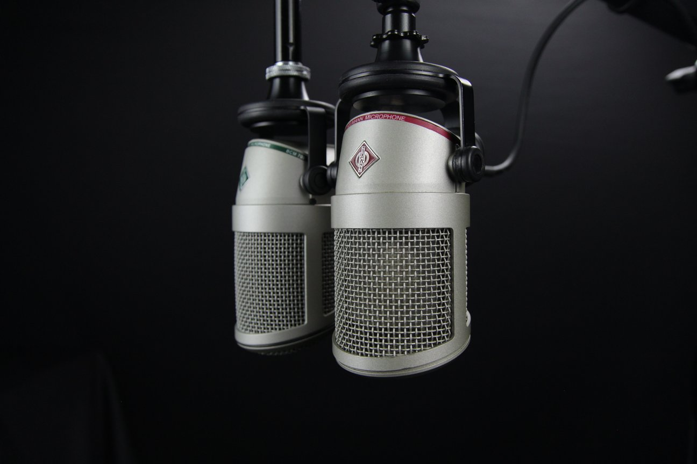
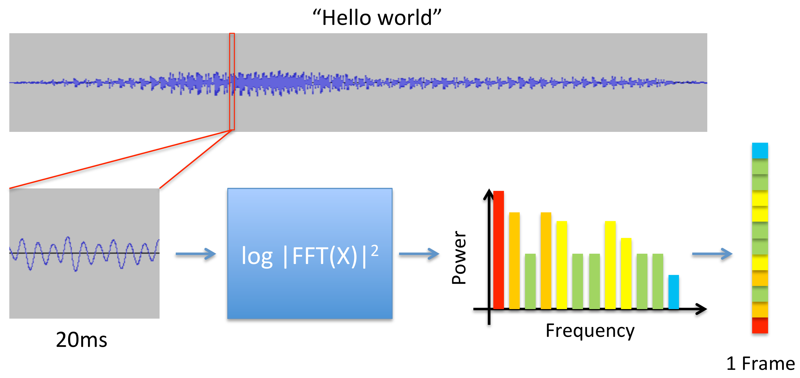

# End-to-End-Automatic Speech Recognition 

<ul>
<li>The architecture is Encoder-Attention-Decoder</li>
<li>The system consists of acoustic processor and linguistic decoder</li>
<li>
The traditional way:  
<ol>
<li>Acousting input is a sequence of individual observation</li>
<li>Output is a sequence of words</li>
<li>The speech signal is 1-D</li>
</ol>
Cons:
<ol>
<li>The speech signal is quasi-stationary</li>
<li>Inter speaker and intra speaker variability</li>
<li>Variation in the rate of speaking, pitch, volume affects the decoding</li>
</ol>
</li>
<li>Feature extraction is needed</li>
<li>Simplest feature we can extract  is spectogram</li>
<li>Typically extract a short-time fourier spectrum</li>
<li>For every 25ms window we get number of features</li>

Formula for getting sequence of words W from language L, maximizing following condition

<li></li>

</ul>

## Resources

### ASR

* [Medium](https://medium.com/intel-student-ambassadors/attention-in-end-to-end-automatic-speech-recognition-9f9e42718d21)

### Signal

* [Signal classification](http://ecetutorials.com/signals-systems/classification-of-signals/)

